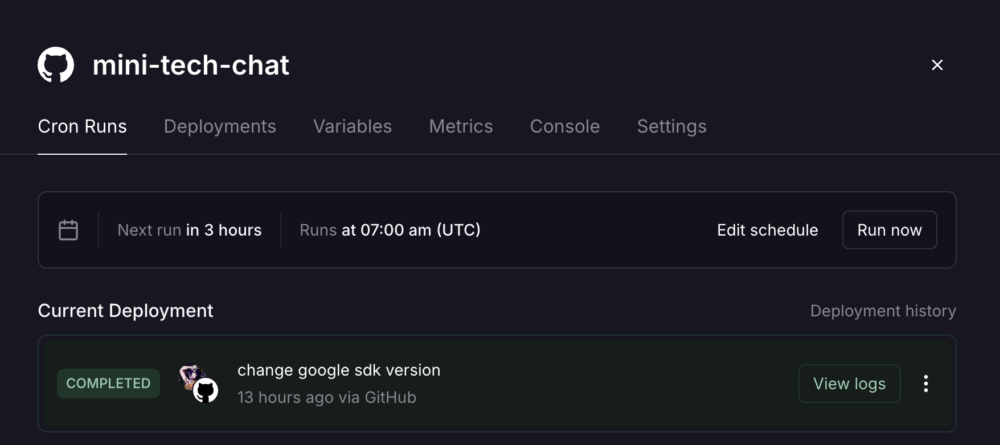
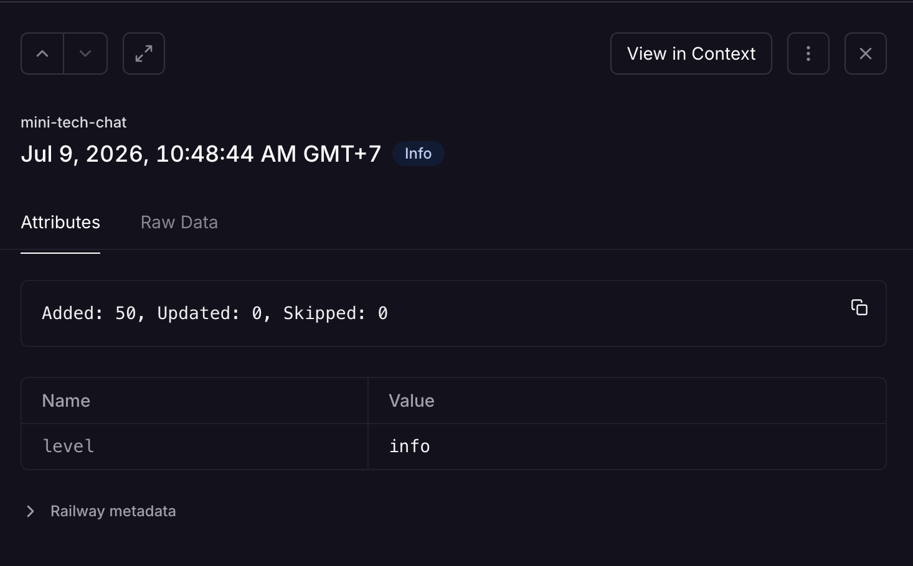
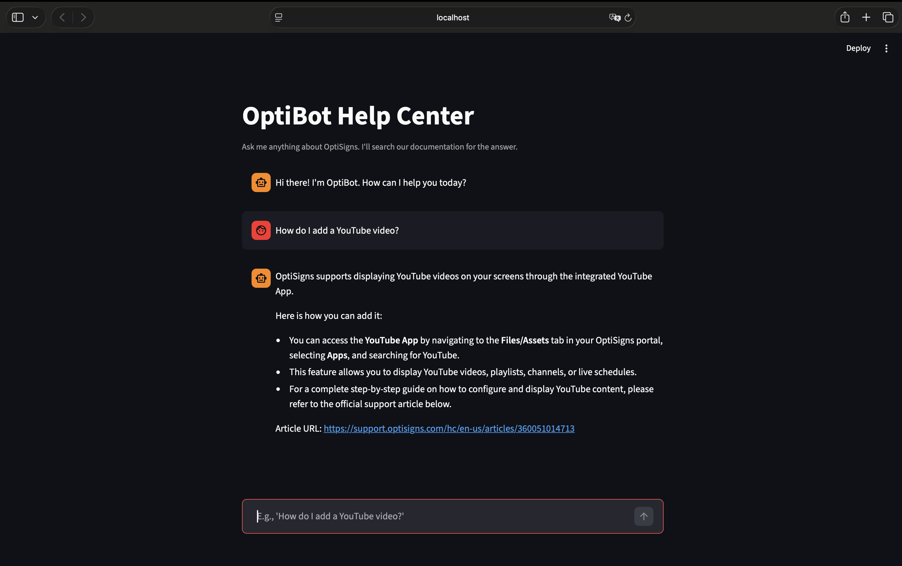

# Knowledge Base Sync & Support Agent (rag-ingestion-pipeline)

An automated data ingestion pipeline and RAG-based AI support assistant. This project scrapes help center articles, converts them to normalized Markdown, and dynamically updates a Google Gemini knowledge base via a daily scheduled containerized job.

## How to Run Locally

### 0. Folder Structure
- assistant.py (no longer use): the file to run and test the bot in terminal, does not have the UI.
- scrape.py (no longer use): the file to run the scrape, no longer use because being wrapped in main.
- main.py: this file is used by Railway to run the scripe and re-scrape daily.
- app.py: the file you will use to run locally.
- Dockerfile: the image building file for Railway.
### 1. Environment Setup
Create a `.env` file in the root directory and add your Google Gemini API key (no hard-coded keys are in this repository), you can see `env.sample`:

```text
GEMINI_API_KEY=your_actual_api_key_here
```

### 2. Running on your local
You only need to move to the repository that have file app.py and run:
```bash
streamlit run app.py
```

### 3. Cron Job
The Cron Job is set up daily on Railway. This will run daily at 7:00 AM (UTC).


This is the daily job log:


### 4. Quick Sanity Check
